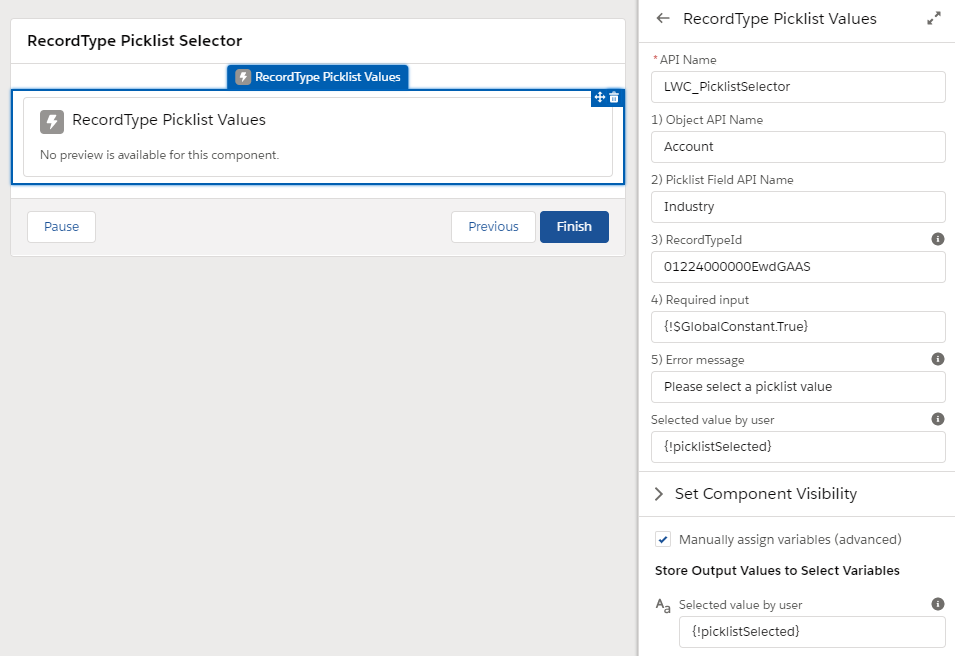
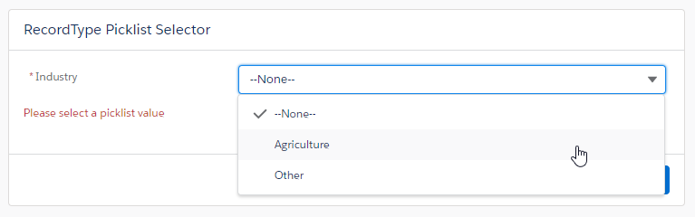
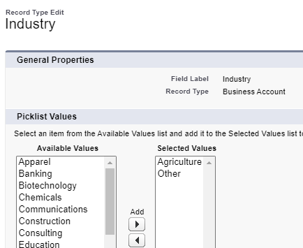

# LWC RecordtType PicklistValue Selector
Lightning Web Component for Salesforce platform allowing front-end selection of an Object Picklist value, restricted by RecordType.

## Challenge
In Salesforce Setup picklist values can be restricted per RecordType.
Allowing distinction in business processes and guiding an end-user through that particulr process.

Unfortunately, those restrictions aren't always satisfied by Salesforce, e.g. in:

* Dynamic Picklist Choices in Lightning Flows ([SF Idea](https://success.salesforce.com/ideaView?id=08730000000cFUuAAM))

## Solution
This Lightning Web Component retrieves and displays the picklist values which are valid for the provided RecordTypeId,
independent of Object and Field. 

The LWC is enabled for usage in a Flow Screens and Record Pages, but can be easily extended.

Lastly, the component includes a Validation message when no Picklist value was selected (to make it required).
The Custom Label should be provided for this one.

### Input:

| Variable | Description |
| --- | --- |
| objectName | API name of Object |
| fieldName | API name of Picklist Field on corresponding Object |
| recordTypeId | Id of RecordType to restrict picklist values with (e.g. retrieve from current record, or retrieved to create new record ) |
| isRequired | Whether input field is required |
| errorMessage | Error message to show in front-end when field required and not provided (e.g. retrieve from CustomLabel via Formula) |

### Output:

| Variable | Description |
| --- | --- |
| FieldValue | Value returned |

## Screenshots

Configuration in Flow, configuring input and output variables.
* The input in the screenshot is purely for documentation purposes to show the correct format;
* NEVER put hard-coded (RecordType) Ids, always retrieve dynamically from a record {!sObj_Account.RecordTypeId} or from server {!Get_RetrieveRecordType.Id};
* Likewise it is recommended to fetch a CustomLabel in Flow and provide that into the component.

Example of Industry picklist value for Business Accounts

# Installation

The LightningWebComponent has been made available as unmanaged package (see links below) (https://login.salesforce.com/packaging/installPackage.apexp?p0=04t08000000xAJR&isdtp=p1) or can be downloaded and Deployed to any Sandbox using SFDX CLI or an IDE.

* [Install on Sandbox Org](https://test.salesforce.com/packaging/installPackage.apexp?p0=04t08000000xAJR)
* [Install on Production/Developer Org](https://login.salesforce.com/packaging/installPackage.apexp?p0=04t08000000xAJR)
